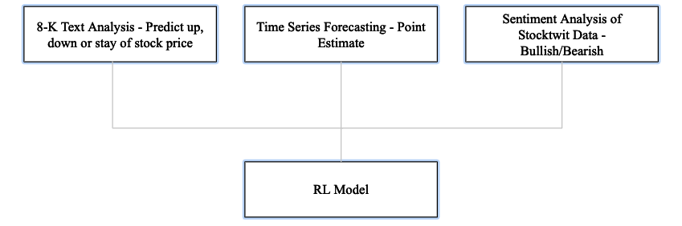
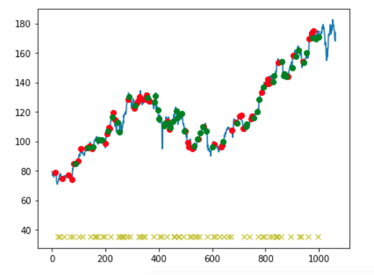

**Abstract** : In the quest for a robust trading strategy capable of navigating the dynamics of a complex environment, Reinforcement Learning algorithms offer significant advantages over traditional Machine Learning techniques. In this paper, we propose multiple deep learning models capable of predicting signals that capture sentiment and major events that affect the stock prices of companies. Signals from the models along with a point estimate from a Time Series models are used as to build a trading agent using a state of the art Actor Critic Reinforcement Learning model. The approach yields a return of 14% average profit on the training data.

Click here to access the [complete paper](Technical_Paper.pdf) and [code here](https://github.com/Samarth2506/Learning/tree/master/Projects/Automated%20Trading%20using%20RL). Below is an informal summary of the project:

 

Want to make some money by investing in the right stocks with minimal effort? Well, consider your time here well spent!

 

## **Current Automated Trading Methods**
Many (or most) of the work in the domain of automated trading have been in Supervised Learning. Typically, prices are forecast with a neural network model with a set of explanatory variables and then fed in to a training module to make a decision based on a threshold. Learning with explicit labels with the intent of minimization of forecast error does not take in to the full complexity of the problem that a typical trader would be influenced by.
Additionally, the dynamic constraints posed by the environment such as liquidity and transaction costs are hard to model with static labels. The problem is further compounded by the fact that current methods are based on statistical arbitrage that typically perform well only with high frequency trades. Hence, sequential decision making with such models with a wider time frame are limited in their approach.

 

## **Enter Reinforcement Learning!**

 

### **Architecture**
We use three base models to capture various aspects that affect the stock price of companies. The first model is a textual analysis of 8-K SEC filings of companies that capture the major events in a company such as major leadership change, bankruptcy, etc. that a company is required to file. Investors often use 8-K filings to base their decisions on stocks. Additionally, 8-K filings are categorized in to multiple items that provides additional insight in to the nature of event occured.
The second model is a simple time series forecast using an LSTM model. And finally, we will use sentiment data already tagged on the Stocktwits platform to capture sentiment of the crowd. The signals from all 3 models constitute the state of the Reinforcement Learning model.

The actor critic model, as the name suggests consists if learning two sets of weights typically with different neural networks. The Actor defines the policy or the behaviour of the agent and the critic defines how good the action is which is also known as the value function. In our implementation, the same set of weights are shared for both tasks.

What exactly are these tasks?

We are learning the probabilities of the actions as well as true reward value for the action. Consequently, the biggest loss for an action assigned low probability would result in a high reward! Below is the sample behaviour of the trading agent:

Finally, we end with a training average profit of 14 percent. We plan to run further experiments to deliver further insights. Stay tuned!