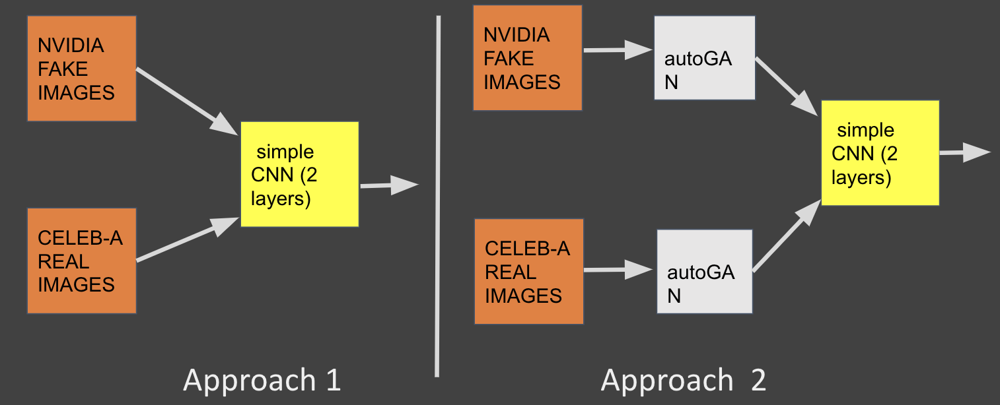
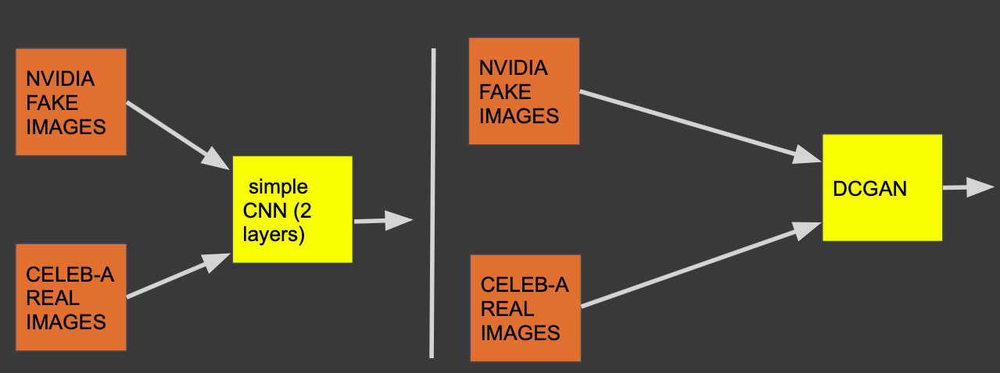

**Abstract** : The goal of the study is to detect fake images. An autoencoder is trained adversarially to obtain a latent rich representation of real images. The latent representation is then used to reconstruct an image based on the given input image. We propose a comparative study to test if reconstructed features differ strongly for real and fake images leading to enhanced classification performance. We further argue that adversarially training a classifier (DCGAN) generalizes better on unseen data as compared to CNN based architectures.

 

## **Motivation**

Recent advances in Generative Adverserial Networks (GANs) have proved both a boon and a bane for the deep learning community. While GANs have made tremendous progress in their ability to synthesize artificial data, the advancement can be misused to architect adverserial attacks. For example, DeepFakes can affect confirmation bias and have consequences on public opinion. Here is a [video](https://www.youtube.com/watch?v=cQ54GDm1eL0&feature=youtu.be) of 'Obama' making a speech. 

The technology can be further misused for financial gain and even revenge. For example, the [Deep Nudes application](https://www.theverge.com/2019/6/27/18760896/deepfake-nude-ai-app-women-deepnude-non-consensual-pornography) renders nudes of women. Scary, isn't it? 

This project demonstrates the potential of using the information learnt by GANs themselves in an effective way to classify images as fake or real.

 

## **Data and Pre-processing**

For real images, a subset of the CelebA-HQ dataset was used. For fake/synthezed images, a subset of Nvidia's StyleGAN dataset was used. 

For efficient computation, the images were resized to Numpy arrays of [64x64] and trained using Google Colab. The models were implemented in PyTorch.

 

## **General Setup**

### **AutoGAN Training**

*Source [Zhang et al., 2019]*

The AutoGAN is trained to reconstruct images based on real images from the CelebA dataset. The encoder network outputs a latent representation which is given to the decoder layer to generate images. As a result, the network outputs a reconstructed image for every real image (pair-wise generation).

An additional variation experimented was using a 1-layer AutoGAN versus 4-layers to test if more complex architectures of AutoGANs can learn better.

### **Experiment - 1**

In Approach 1, The real and fake images were passed for a simple CNN classification (using the Alexnet architecture). For Approach 2, The real and fake images were first passed to the trained AutoGAN and each result was then passed to Alexnet for the final classification.

 

### **Experiment - 2**

## **Results**

### **Experiment - 1 Performance**

### **Experiment - 2 Performance**

## **Takeaways**

<!-- *Fig. 1: Something* -->

<!--  -->

Click here to access the [complete paper](Detect_DeepFakes_GANs.pdf) and [code here](https://github.com/Samarth2506/DL_Project).

